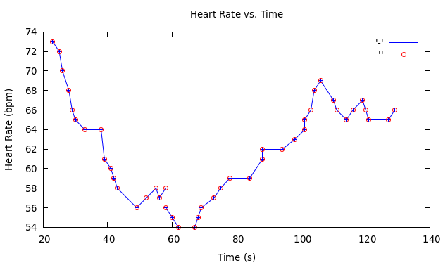

### Heart rate monitor for Mi Band 6 and 7

This is a C implementation of the [miband-6-heart-rate-monitor](https://github.com/gzalo/miband-6-heart-rate-monitor) 

**Real time heart rate monitor for Mi Band 6 and 7 using c**

Note: Currently Mi Band 7 is not working properly



## Requirements

1. Install dependencies:
```
sudo apt-get install libssl-dev
sudo apt install libbluetooth-dev libreadline-dev
```
2. Clone this repository

3. Clone [gattlib](https://github.com/labapart/gattlib)

4. Build Gattlib
```
cd <gattlib-src-root>
mkdir build && cd build
cmake ..
make
sudo make install
```
5. Clone [tiny-ECDH-c](https://github.com/kokke/tiny-ECDH-c)

6. Add this code to a file named CMakeLists.txt, and put it into the tiny ECDH main folder:
```
cmake_minimum_required(VERSION 3.10)
project(tiny-ECDH-c C)

set(CMAKE_C_STANDARD 11)

add_library(tiny-ECDH-c STATIC ecdh.c)
target_include_directories(tiny-ECDH-c PUBLIC ${CMAKE_CURRENT_SOURCE_DIR})
```

## How to use

1. Find your Mi Band's Authentication Key ([Check Here](https://codeberg.org/argrento/huami-token))

2. Go to the root folder of this repository (cd miband-HR-c)

3. Put your authentication key to `auth_key.txt` file in the current directory.

4. Turn off Bluetooth on your mobile device paired with the band

5. Find out your band MAC address using bluetoothctl
```
sudo bluetoothctl
scan on
devices
```
6. Go to root folder, create a build folder and navigate to it
```
mkdir build && cd build
```
7. Run:
```
// For Mi Band 6
cmake -DMAC_ADDRESS="YOUR_MAC_ADDRESS" ..
make
./miband_c

// For Mi Band 7
cmake -DMAC_ADDRESS="YOUR_MAC_ADDRESS" -DBAND_TYPE "7" ..
make
./miband_c
```

## Doxygen

This code is documented using Doxygen style.

1. Install Doxygen
```
sudo apt install doxygen
```

2. Generate Doxyfile
```
doxygen -g Doxyfile
```

3. Make changed in the Doxyfile
```
INPUT = .
RECURSIVE = YES
```

4. Run Doxygen
```
doxygen Doxyfile
```

5. Open index.html inside the html folder

## References

- [gzalo/miband-6-heart-rate-monitor](https://github.com/gzalo/miband-6-heart-rate-monitor)
- [patyork/miband-7-monitor](https://github.com/patyork/miband-7-monitor) 
- [Jaapp-/miband-5-heart-rate-monitor](https://github.com/Jaapp-/miband-5-heart-rate-monitor)
- [satcar77/miband4](https://github.com/satcar77/miband4)
- [vshymanskyy/miband-js](https://github.com/vshymanskyy/miband-js)
- [vshymanskyy/miband2-python-test](https://github.com/vshymanskyy/miband2-python-test)
- [VladKolerts/miband4](https://github.com/VladKolerts/miband4)
- [Gadgetbridge](https://codeberg.org/Freeyourgadget/Gadgetbridge)

## Libraries

- [tiny-ECDH-c](https://github.com/kokke/tiny-ECDH-c)
- [gattlib](https://github.com/labapart/gattlib)
- [glib](https://github.com/GNOME/glib)
- [OpenSSL](https://github.com/openssl/openssl)

## TODO

1. More robust memory allocation
2. Develop Band 7 interface
3. Implement Spo2 measurement